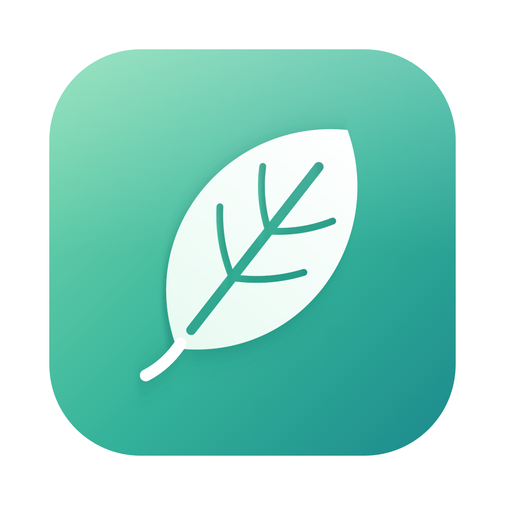
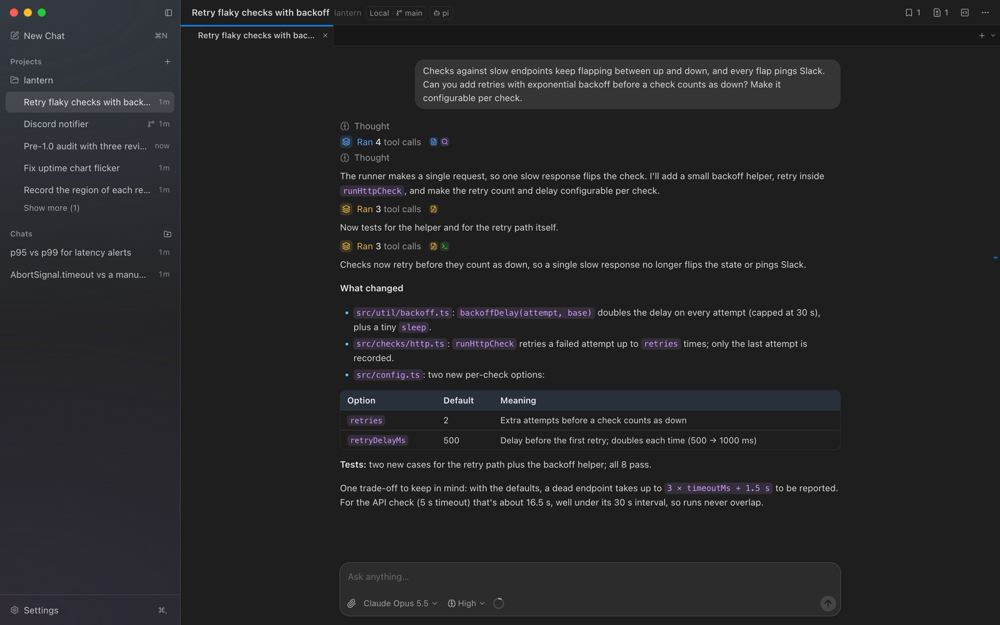
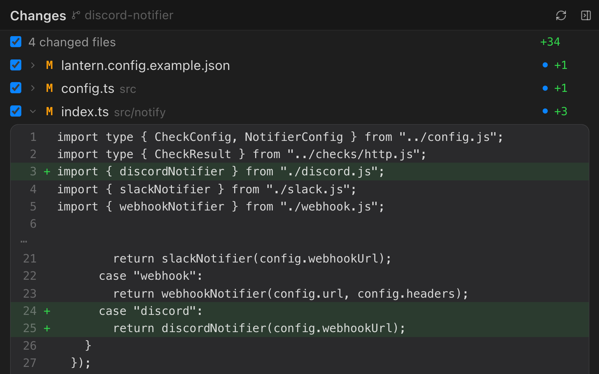
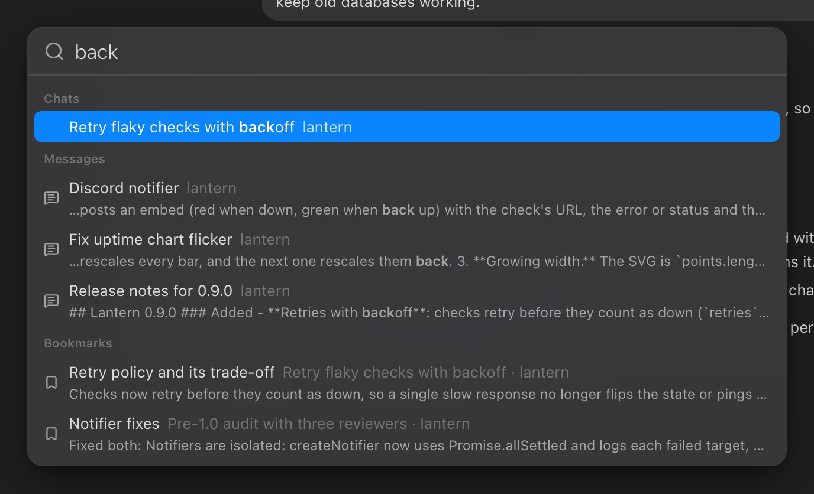

<p align="center">
  
</p>

<h1 align="center">Glade</h1>

<p align="center">
  A native Mac app for your coding agents.<br>
  Run pi, Claude Code and Codex side by side, with sub-agents, local models and your iPhone as a remote.
</p>

<p align="center">
  <a href="https://jas7457.github.io/glade/"><strong>Website</strong></a> ·
  <a href="#build-from-source">Build from source</a> ·
  <a href="CHANGELOG.md">Changelog</a>
</p>



<table>
  <tr>
    <td width="50%"></td>
    <td width="50%"></td>
  </tr>
</table>

See everything Glade does on **[the website](https://jas7457.github.io/glade/)**.

## Build from source

Glade isn't a signed download yet. You'll need macOS, Node.js 22.13 or newer, pnpm
(`corepack enable`), Rust and the Xcode Command Line Tools, and at least one agent installed and
signed in: [pi](https://github.com/earendil-works/pi), Claude Code or Codex.

```bash
git clone https://github.com/jas7457/glade.git
cd glade
pnpm install
pnpm tauri:install
```

`pnpm tauri:install` builds Glade and puts it in your Applications folder. To update later, use
**Update Now** in Settings → General.

Using Glade from your other Macs or your iPhone needs Tailscale: see
[docs/remote-access.md](docs/remote-access.md).

## Contributing

See [CONTRIBUTING.md](CONTRIBUTING.md). MIT licensed ([LICENSE](LICENSE)).
